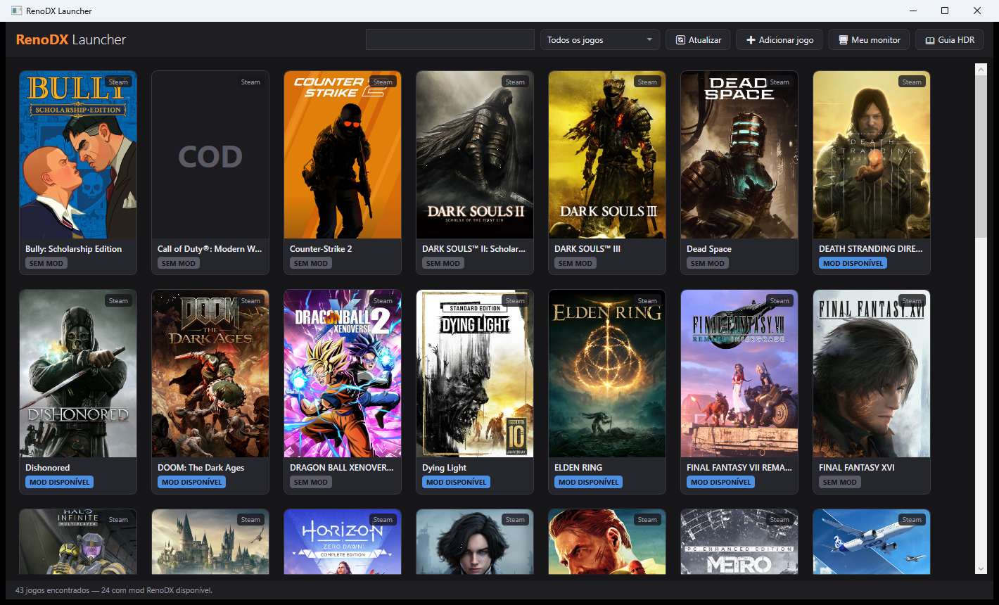

<div align="center">


# RenoDX Launcher

**Install, toggle and tune [RenoDX](https://github.com/clshortfuse/renodx) HDR mods for your PC games — without leaving the launcher.**

[](https://github.com/xdzleo/renodx-launcher/releases/latest)
[](LICENSE)
[](#install)

[English](README.md) · [Português](README.pt-BR.md)

</div>



[**RenoDX**](https://github.com/clshortfuse/renodx) — short for "Renovation Engine for DirectX
Games" — is [clshortfuse](https://github.com/clshortfuse)'s toolset for modding games through
ReShade's add-on system, and the reason proper per-game HDR exists on PC for hundreds of titles.
This project is not RenoDX. It is a launcher **for** RenoDX: it scans your installed games,
matches them against the RenoDX catalogue, and handles the setup those mods otherwise need by
hand — ReShade, the right addon, the right proxy DLL, and the mod's own brightness settings.

The mods, and the work that makes any of this worth using, are theirs.

## Install

Download **`RenoDXLauncher-<version>-setup.exe`** from the
[latest release](https://github.com/xdzleo/renodx-launcher/releases/latest) and run it.

Self-contained — no .NET runtime to install. Windows 10 or 11, x64. A portable `.zip` is
published alongside the installer for people who prefer not to install anything, and every
release ships `SHA256SUMS.txt`.

## Features

**Game detection** across Steam, Epic, GOG, Xbox / Game Pass and Battle.net, plus any folder you
add by hand — including folders that don't carry the game's name, which are resolved by the
executable instead.

**A merged catalogue of ~890 games**, built from the official RenoDX index, the mods wiki (fork
mods, Nexus-only mods, and the generic Unreal and Unity tables) and the RHI dataset for per-game
install paths, graphics API and curated notes.

**One-click install.** Fetches ReShade with addon support, verifies its signature, reads the
game executable's import table to pick the correct proxy DLL — `dxgi.dll`, `d3d9.dll`,
`opengl32.dll` — and drops the matching `renodx-<game>.addon64` next to it.

**Enable and disable per game**, and update every installed mod in one pass when new builds ship.

**The mod's settings, in the launcher.** Peak brightness, paper white, UI brightness, tone
mapper, gamma and the full colour grading set, written straight into the game's `ReShade.ini`.
A bundled manifest of 6,698 settings across 294 games — extracted from the renodx source — means
each key is written with the exact casing its mod expects.

**A display profile.** Measure your monitor's peak nits once; apply it to any game in one click.

**Built-in HDR checklist** covering the things that silently ruin HDR: Windows HDR on, AutoHDR
and RTX HDR off, HGIG, and the anti-cheat warning for online games.

**English and Brazilian Portuguese**, following your Windows language by default.

## Command line

Everything the interface does also runs headless — for scripting, for diagnostics, and for
filing a useful bug report.

```bash
RenoDXLauncher.exe list                       # detected games and mod status
RenoDXLauncher.exe check                      # which mods have a newer build
RenoDXLauncher.exe verify                     # did the mod actually load? (reads ReShade.log)
RenoDXLauncher.exe settings "dying light"     # current mod settings
RenoDXLauncher.exe set "dying light" ToneMapPeakNits=1300 --dry-run
RenoDXLauncher.exe profile --peak 1300        # display nits profile
RenoDXLauncher.exe install "elden ring"       # install ReShade + addon
RenoDXLauncher.exe enable "sekiro"            # enable / disable the mod
RenoDXLauncher.exe add "C:\path\to\folder"    # register a folder the stores don't know
RenoDXLauncher.exe doctor                     # full diagnostic
```

Game names match on any substring, case-insensitively. `list` and `check` accept `--json`. `set`
prints the target file and the before → after; `--dry-run` writes nothing. Installing from the
CLI aborts when anti-cheat is detected — the informed-risk confirmation exists only in the UI.

## How it handles your games

The launcher is deliberately conservative about other people's files:

- it never writes `ReShade.ini` while the game is running, because the overlay rewrites the whole
  section when the game exits;
- it preserves the casing of keys already in the ini, since the mod reads them case-sensitively;
- it refuses to overwrite a proxy DLL it cannot positively identify as ReShade, so ENB, dxvk and
  Special K installs are left alone;
- it keeps exactly one renodx addon per folder, because two addons fight over the same keys;
- it verifies the ReShade download against the ReShade author's signing certificate before
  extracting anything;
- it detects anti-cheat and warns before installing, because addon-capable ReShade is an unsigned
  build and that is a ban risk online.

## Building

Requires the .NET 10 SDK on Windows.

```powershell
dotnet build src\RenoDXLauncher.csproj          # debug
pwsh tools\build-installer.ps1 -Zip             # publish + installer into dist\
```

`tests\SmokeTest` exercises the entire pipeline against a fake game — catalogue, matching, a real
ReShade download and extraction, addon install, toggle, and settings round-trip. It never touches
a real game folder.

```powershell
cd tests\SmokeTest; dotnet run
```

`tests\ScanProbe` runs each store detector in isolation and reports what it found and how long it
took — the first thing to run when a game doesn't show up.

## Translating

Strings live in [`src/Localization/strings.json`](src/Localization/strings.json), all languages
side by side so a translation can be reviewed in one place.

1. add your `"<bcp-47-tag>"` entry to the strings you're translating;
2. run `python tools/gen_resx.py`;
3. register the tag in `L.Available` (`src/Localization/L.cs`) and in
   `SatelliteResourceLanguages` (`src/RenoDXLauncher.csproj`).

Untranslated keys fall back to Brazilian Portuguese, so a partial translation is still shippable.

## Documentation

- [Code signing policy](docs/code-signing-policy.md)
- [Release signing setup](docs/SIGNING-SETUP.md)
- [Antivirus false positives](docs/antivirus.md)
- [Changelog](CHANGELOG.md)

## Credits

This launcher is a client for other people's work. All of it.

- **[clshortfuse/renodx](https://github.com/clshortfuse/renodx)** — RenoDX itself, and every mod
  maintainer who ports and tunes a game. The catalogue, the settings this launcher writes, and
  the reason any of it looks right on screen come from them.
  [Mods list](https://github.com/clshortfuse/renodx/wiki/Mods) ·
  [Discord](https://discord.gg/F6AUTeWJHM)
- **[crosire/reshade](https://github.com/crosire/reshade)** — the add-on runtime RenoDX is built
  on, and which this launcher installs.
- **[RankFTW/RHI](https://github.com/RankFTW/RHI)** — per-game install data (`manifest.json`,
  GPL-3.0), used with credit.

Bug reports about a *mod* belong upstream with the mod's maintainer, not here. Issues with the
launcher itself — detection, installation, the settings UI — belong in
[this repository](https://github.com/xdzleo/renodx-launcher/issues).

## License

MIT — see [LICENSE](LICENSE). Bundled Inter font under the SIL Open Font License 1.1.
